<div align="center">

# Health Insurance Charges Analysis

### Exploratory Data Analysis • Statistical Modeling • Linear Regression

<p>
  
  
  
  
</p>

<p>
A compact statistical analysis of the demographic and lifestyle factors associated with annual health insurance charges.
</p>

**Smoking status is the strongest predictor, while age and BMI provide additional explanatory power.**

</div>

---

## Project at a Glance

| | |
|---|---|
| **Goal** | Explain and predict annual medical insurance charges |
| **Dataset** | 1,338 insurance records |
| **Target** | `charges` — annual medical costs in USD |
| **Predictors** | Age, sex, BMI, children, smoking status, region |
| **Best compact model** | Age + BMI + children + smoker |
| **Adjusted R²** | **0.7489** |
| **Most influential factor** | **Smoking status** |

> **Headline finding:** after controlling for age, BMI, and number of children, smokers are predicted to incur approximately **$23.8K more in annual charges** than otherwise comparable non-smokers.

---

## Navigation

<p align="center">
  <a href="#-dataset">Dataset</a> •
  <a href="#-exploratory-data-analysis">EDA</a> •
  <a href="#-relationships-with-charges">Relationships</a> •
  <a href="#-regression-results">Regression</a> •
  <a href="#-key-findings">Findings</a> •
  <a href="#-limitations">Limitations</a>
</p>

---

## Dataset

The dataset contains **1,338 observations** and **7 variables**, with no missing values.

| Variable | Type | Description |
|---|---|---|
| `age` | Numerical | Age of the insured individual |
| `sex` | Categorical | Biological sex |
| `bmi` | Numerical | Body Mass Index |
| `children` | Numerical | Number of dependent children |
| `smoker` | Categorical | Smoking status |
| `region` | Categorical | U.S. residential region |
| `charges` | Numerical | Annual medical insurance charges |

<details>
<summary><b>Quick descriptive statistics</b></summary>

<br>

| Metric | Value |
|---|---:|
| Observations | 1,338 |
| Missing values | 0 |
| Mean annual charges | ~$13,270 |
| Median annual charges | ~$9,382 |
| Age range | 18–64 |
| Mean BMI | ~30.7 kg/m² |
| Smokers | 274 / 1,338 |
| Non-smokers | 1,064 / 1,338 |

</details>

---

# Exploratory Data Analysis

## Quantitative Variables

<table>
<tr>
<td width="50%" align="center">
<b>Age</b><br><br>
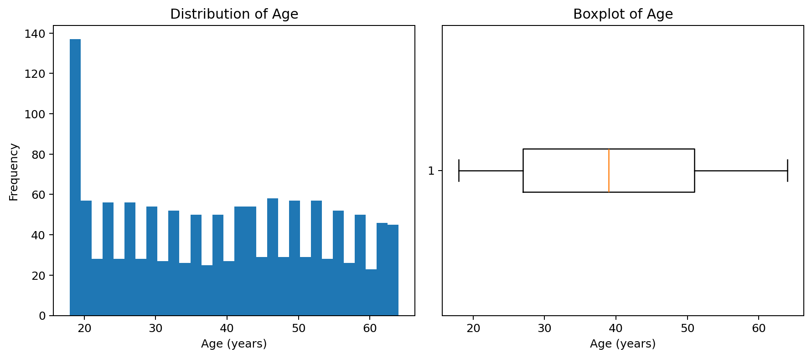
</td>
<td width="50%" align="center">
<b>BMI</b><br><br>
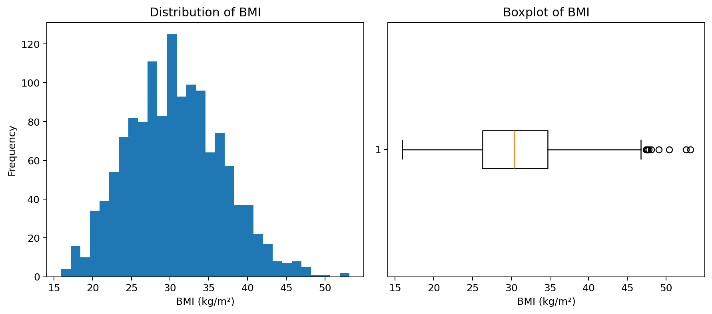
</td>
</tr>
<tr>
<td width="50%" align="center">
<b>Children</b><br><br>
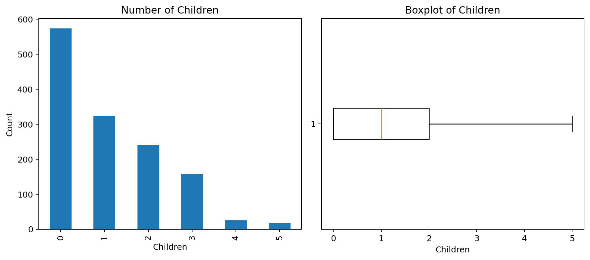
</td>
<td width="50%" align="center">
<b>Charges</b><br><br>
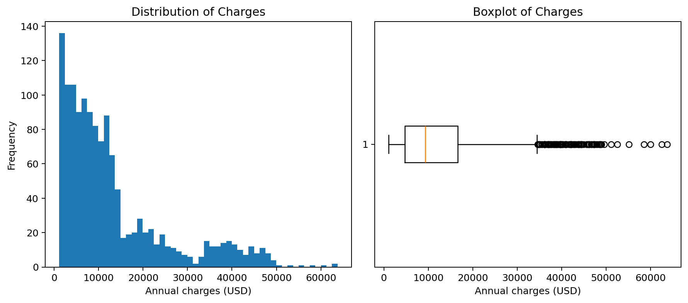
</td>
</tr>
</table>

### What stands out?

- **Age** is fairly evenly distributed between 18 and 64.
- **BMI** is centered around approximately **30.7 kg/m²**, with several high-end observations.
- **Children** is right-skewed; about **43%** of individuals have no dependent children.
- **Charges** is strongly right-skewed, with a relatively small group accounting for very high annual medical costs.

---

## Categorical Variables

<table>
<tr>
<td width="33%" align="center">
<b>Sex</b><br><br>
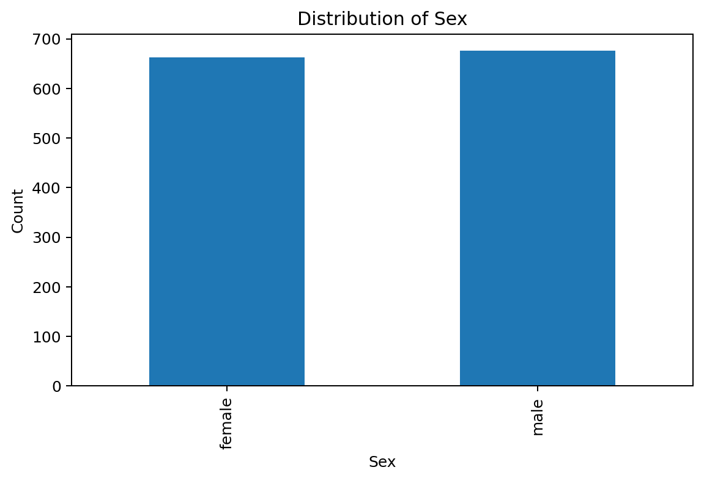
</td>
<td width="33%" align="center">
<b>Smoking Status</b><br><br>
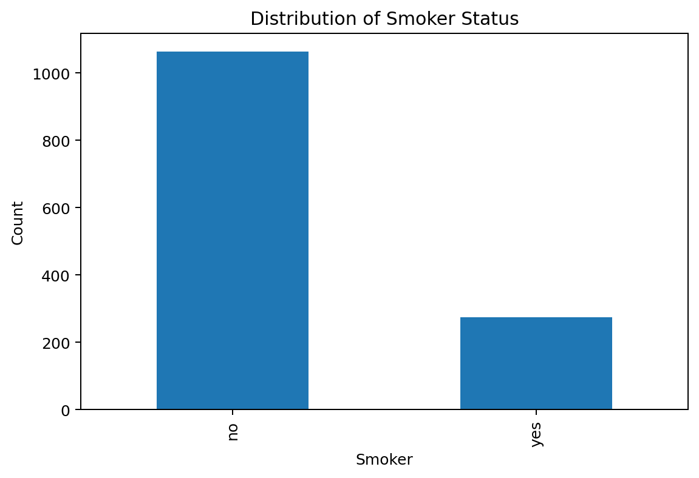
</td>
<td width="33%" align="center">
<b>Region</b><br><br>
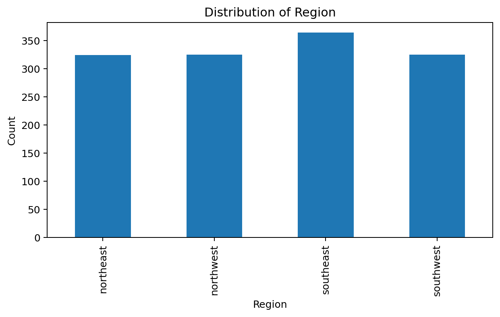
</td>
</tr>
</table>

The sample is almost perfectly balanced by sex and reasonably balanced across regions. Smoking status is more asymmetric: **79.5% are non-smokers** and **20.5% are smokers**.

---

# Relationships with Charges

## Pairwise View

<p align="center">
  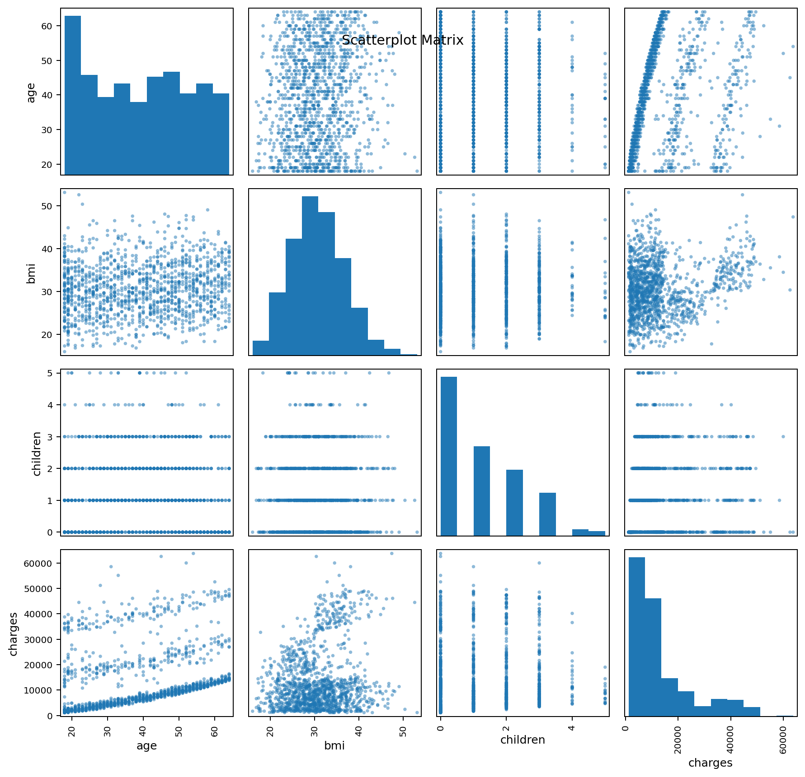
</p>

The pairwise view suggests that:

- Charges tend to increase with **age**.
- **BMI** has a positive but weaker marginal relationship with charges.
- **Children** shows little standalone linear relationship with charges.
- The structure of charges suggests that categorical effects—especially smoking—may explain much more than the continuous variables alone.

---

## Continuous Predictors

<table>
<tr>
<td width="50%" align="center">
<b>Charges vs Age</b><br><br>
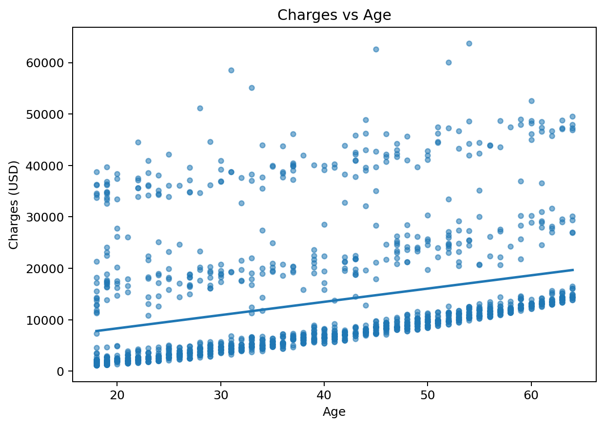
</td>
<td width="50%" align="center">
<b>Charges vs BMI</b><br><br>
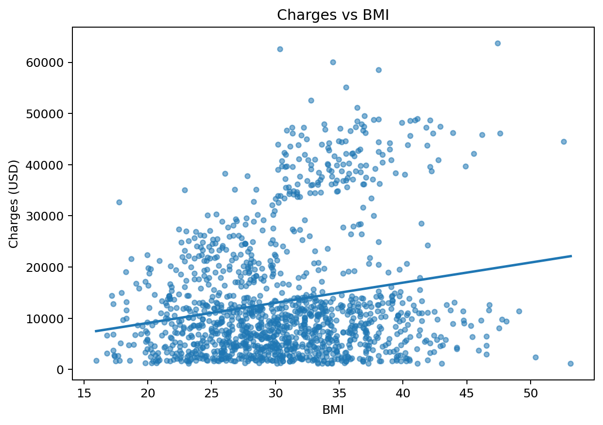
</td>
</tr>
</table>

<p align="center">
  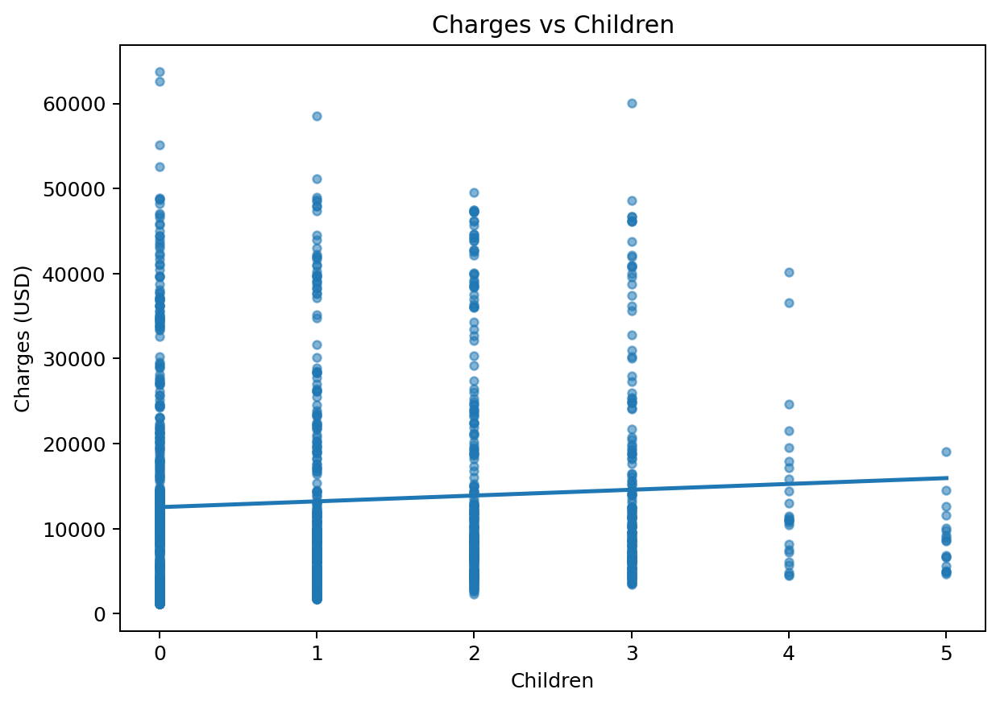
</p>

| Predictor | Approx. effect | R² | Interpretation |
|---|---:|---:|---|
| Age | +$258 / year | 0.089 | Meaningful positive association |
| BMI | +$394 / BMI unit | 0.039 | Significant but weak alone |
| Children | +$683 / child | 0.0046 | Very weak standalone fit |

---

## Categorical Effects

<p align="center">
  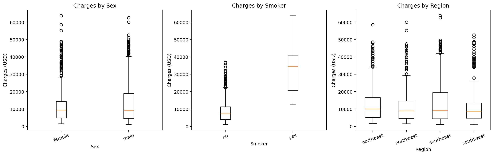
</p>

The clearest separation is produced by **smoking status**. Sex and region show far smaller differences in their charge distributions.

---

# Regression Results

## Model Comparison

| Model | Predictors | R² / Adjusted R² | Takeaway |
|---|---|---:|---|
| Age only | Age | **0.089** | Explains ~8.9% of charge variance |
| BMI only | BMI | **0.039** | Limited standalone explanatory power |
| Children only | Children | **0.0046** | Weakest simple predictor |
| Smoker only | Smoker | **0.619** | Dominant single predictor |
| Full model | All predictors | **Adj. 0.7494** | Strong overall fit |
| Reduced model | Age + BMI + Children + Smoker | **Adj. 0.7489** | Nearly identical fit with fewer variables |

### Why the reduced model?

The reduced model removes **sex** and **region**, which contribute little additional explanatory value once age, BMI, children, and smoking status are accounted for.

<p align="center">
  
</p>

### Final Model

<div align="center">

**Predicted Charges ≈ −12,103 + 257.85(Age) + 321.85(BMI) + 473.50(Children) + 23,811.40(Smoker)**

</div>

<details>
<summary><b>Interpret the coefficients</b></summary>

<br>

- **Age:** each additional year is associated with approximately **$258 higher annual charges**.
- **BMI:** each additional BMI unit is associated with approximately **$322 higher annual charges** after adjustment.
- **Children:** each additional child is associated with approximately **$474 higher annual charges**.
- **Smoker:** smokers are predicted to incur approximately **$23,811 more per year** than comparable non-smokers.

</details>

---

# Key Findings

<table>
<tr>
<td width="50%" valign="top">

### Smoking dominates

Smoking status alone explains approximately **61.9%** of charge variation.

In the multivariable model, the estimated smoking effect remains extremely large at roughly **+$23.8K/year**.

</td>
<td width="50%" valign="top">

### Age matters

Older individuals tend to incur higher medical costs.

The relationship remains significant after adjustment for the other predictors.

</td>
</tr>
<tr>
<td width="50%" valign="top">

### BMI adds signal

Higher BMI is associated with higher annual charges.

Its standalone explanatory power is modest, but it contributes meaningfully in the multivariable model.

</td>
<td width="50%" valign="top">

### Simpler is almost as good

Removing sex and region changes adjusted R² only from **0.7494 → 0.7489**.

The reduced model is therefore more parsimonious without materially sacrificing explanatory power.

</td>
</tr>
</table>

---

## Example Prediction

For a **40-year-old**, **BMI 30**, with **2 children**:

| Scenario | Predicted annual charge |
|---|---:|
| Non-smoker | **~$8,814** |
| Smoker | **~$32,625** |
| Difference | **~+$23,811** |

This illustrates how strongly smoking status shifts the model prediction even when the other characteristics are identical.

---

# Interpretation

The analysis indicates that insurance charges are not explained equally by all available demographic variables.

**Smoking status is the dominant factor**, while **age** and **BMI** provide additional independent explanatory information. The number of children has a smaller positive effect. By contrast, sex and geographic region contribute little once the other variables are controlled for.

The reduced model captures roughly **75% of observed charge variation** using only four predictors, making it a useful and interpretable statistical summary of the dataset.

---

# Limitations

- The dataset is **observational**, so regression coefficients represent associations rather than established causal effects.
- Important determinants such as medical history, income, exercise, diet, and insurance-plan characteristics are unavailable.
- Insurance charges are strongly right-skewed, which may challenge standard linear-model assumptions.
- Linear regression does not automatically capture nonlinear relationships or interaction effects.
- Results should not be assumed to generalize to every population or healthcare system.

---

<details>
<summary><b>Repository Structure</b></summary>

```text
.
├── README.md
├── insurance.csv
└── figures/
    ├── age_distribution.png
    ├── bmi_distribution.png
    ├── charges_distribution.png
    ├── children_distribution.png
    ├── sex_distribution.png
    ├── smoker_distribution.png
    ├── region_distribution.png
    ├── scatterplot_matrix.png
    ├── charges_vs_age.png
    ├── charges_vs_bmi.png
    ├── charges_vs_children.png
    └── charges_by_categories.png
```

</details>

---

<div align="center">

### If you found this analysis useful, consider starring the repository.

**Health Insurance Charges Analysis**

EDA • Statistical Inference • Regression Modeling

</div>
